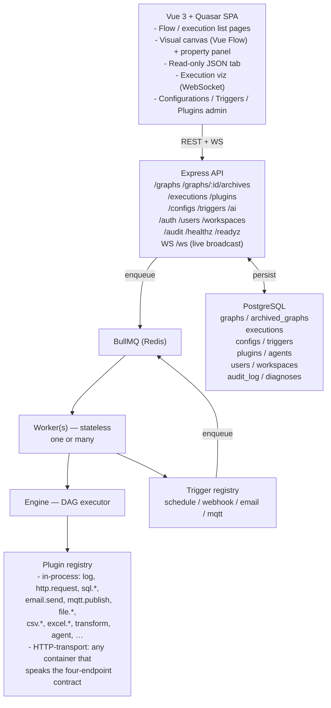

# Overview

**Audience:** developers and devops folk who already read
[Philosophy](./00-philosophy.md) / [Design choices](./00-design-choices.md)
and want a concrete picture of the engine — diagrams, the execution
algorithm, the plugin contract, the data model, and how it scales.

## At a glance

Daisy-DAG is a JSON-defined DAG workflow runner with:

- A drag-and-drop **visual editor** (Vue 3 + Quasar + Vue Flow).
- A **stateless API** (Express) and **stateless worker** (BullMQ).
- A **plugin system** that supports both in-process Node plugins and
  HTTP-transport plugins in their own containers.
- **FEEL** as the expression language inside `${...}` placeholders.
- **Postgres + Redis** as the only persistent stores.
- **Configurations** for typed, encrypted-at-rest secrets, referenced
  by name from plugins.
- **Triggers** (schedule / webhook / email / mqtt) that enqueue
  workflow runs on external events.
- **An AI assistant** for authoring acceleration, **diagnose-on-demand**
  for failed nodes, and a **plugin generator agent** that drafts new
  plugins from English prompts.

## Component diagram



## What runs where

**Backend** — Node.js (ESM). Two process types share the same source
tree:

- **API server** (`src/server.js`) — Express with all the route
  modules under `src/api/`. Owns auth, WebSocket fan-out, plugin
  registry reads, rate limiting, and audit logging.
- **Worker** (`src/worker.js`) — BullMQ consumer that runs DAGs, plus
  the trigger manager that subscribes to event sources, plus
  background loops (retention, plugin healthcheck).

In dev, `npm run dev` runs both in one process. In prod you scale
them independently.

**Frontend** — Vue 3 + Quasar with the canvas built on Vue Flow. The
property panel renders inputs straight off each plugin's JSON Schema
(with custom keywords `title`, `format: "textarea"`, `placeholder`,
…) and the Returns panel off the plugin's `outputSchema`. The JSON
tab is read-only — you edit through the canvas + property panel.

**Engine** — pure JS, lives in `backend/src/engine/`. Topologically
schedules layers and runs each layer's nodes in parallel with
`Promise.allSettled`. Wraps `registry.invoke()` in per-node timeouts,
clamps retries, threads an `AbortSignal` for cooperative cancellation,
and enforces a token budget across LLM-shaped nodes per execution.

## Execution algorithm

1. **Load & validate.** Fetch the graph row, prefer the `parsed` JSONB
   cache, otherwise re-parse the canonical `dsl` JSON. Validate against
   the schema, check every `edge.from` / `edge.to` resolves to a node,
   and run a Kahn's-algorithm cycle check.

2. **Build the DAG.** Produce an in-memory adjacency list and an
   indegree map.

3. **Initialise context.**

   ```
   ctx = {
     ...data,                      // graph.data
     ...userInput,                 // run-time inputs
     nodes:  {},                   // populated as nodes complete
     config: { ...decryptedConfigs },
     env:    { ...envProjection of configs },
     execution: { id, workspaceId, … },
     limits: { workflowTimeout, nodeTimeout, tokenBudget },
     signal,                       // AbortSignal for cooperative cancellation
     hooks:  { stream, … },
   }
   ```

   Every `${...}` placeholder is evaluated against this context. Pure
   dotted lookups (`${nodes.fetch.output.body.title}`) take a fast
   path; richer expressions pass through the FEEL evaluator (`feelin`)
   with helpers (`toJson`, `parseJson`, `toJsonPretty`) injected.

4. **Schedule layer-by-layer.**

   - Pop every node whose `indegree === 0` into the *ready set*.
   - Run them in parallel with `Promise.allSettled`.
   - Each node:
     1. Resolves `executeIf`. If false → status `skipped`. The engine
        cascades `skipped` to descendants reachable *only* through
        this node; parallel branches that converge downstream still
        get a chance.
     2. Detects `batchOver` → resolves to an array → fans out, one
        plugin call per item, collects results into
        `{ items: [...], count: N }`.
     3. Calls the plugin with the resolved input via the registry
        (in-process: direct call; HTTP-transport: POST to `/execute`
        with the standardised payload).
     4. On error: retries up to `retry` times with `retryDelay`. If
        still failing, `onError` decides:
        - `continue` → status `failed`, downstream nodes still run.
        - `terminate` (default) → engine aborts; remaining nodes are
          marked `skipped`.
   - After settling, decrement indegree of every successor and add
     newly-ready successors to the next layer.

5. **Persist.** Every node lifecycle event (`started`, `succeeded`,
   `failed`, `skipped`, `retrying`) is appended to
   `backend/logs/node-events.log` (JSONL) and broadcast on the
   WebSocket as `{ executionId, node, status, at, output?, error? }`.
   The post-run summary lands on `executions.context.nodes`.

6. **Finalise.** The execution row gets `status` (`success` |
   `failed` | `partial`), `finished_at`, and the **redacted**
   `context` — `config` and `env` are stripped, so secrets never
   round-trip into the persisted blob.

## Plugin contract

An in-process plugin is a plain object:

```js
export default {
  name: "http.request",
  description: "Performs an HTTP request via fetch.",
  primaryOutput: "body",
  inputSchema:  { /* JSON Schema */ },
  outputSchema: { /* JSON Schema */ },
  async execute(input, ctx) { /* return output object */ },
};
```

An HTTP-transport plugin is *any process* exposing four endpoints:

| Method | Path        | Purpose                          |
|--------|-------------|----------------------------------|
| GET    | `/manifest` | Plugin manifest JSON.            |
| GET    | `/healthz`  | Liveness — 200 if process is up. |
| GET    | `/readyz`   | Readiness — 200 iff deps usable. |
| POST   | `/execute`  | Run the plugin.                  |

Both kinds register in the same `plugins` Postgres table; the engine
dispatches based on `transport_kind`. See
[Plugin architecture](./16-plugin-architecture.md) for the full
manifest shape, the SDK, the marketplace catalog, and the AI plugin
generator.

The registry validates input against `inputSchema` before invoking
`execute`. `primaryOutput` is the key on the returned object that the
engine writes to `ctx[outputVar]` when the node-level `outputVar` is
set. The frontend property panel renders straight off `inputSchema`
so the canvas is always in sync with the plugin code.

## Configurations

The typed config system lives in `backend/src/configs/`:

- **registry** — defines each type (`mail.smtp`, `mail.imap`,
  `mqtt`, `database`, `generic`, `ai.provider`, …) with its fields,
  `required` flags, and which fields are `secret` (encrypted at rest).
- **crypto** — KMS envelope: per-row data-encryption keys wrapped by a
  KEK that lives in your KMS of choice (local, AWS KMS, pluggable).
  Rotating the KEK rewraps DEKs without re-encrypting every row.
  See [Configs encryption](./05-configs-encryption.md).
- **loader** — `loadConfigsMap()` reads every row, decrypts secrets,
  and returns `{ <name>: { <field>: <plain> } }`.
  `buildConfigEnv(map)` flattens the same data into env-var-shaped
  keys (`CONFIG_<NAME>_<FIELD>`).

The worker injects both shapes (`ctx.config`, `ctx.env`) at execution
start and strips them before persisting `executions.context`.

## Triggers

`backend/src/triggers/` mirrors the plugin architecture but for event
sources:

- **registry** — auto-loads drivers from `triggers/builtin/`. Each
  driver exports `{ type, configSchema, async subscribe(config, onFire) }`.
- **manager** — on worker boot, lists every enabled `triggers` row,
  looks up its driver, and calls `subscribe` to start listening.
  `onFire(payload)` enqueues a workflow execution with the payload as
  user-supplied input.
- **Built-in drivers:** `schedule` (croner cron + interval),
  `webhook` (HTTP endpoint at `/webhooks/:id`), `email` (IMAP IDLE
  via imapflow), `mqtt` (broker subscribe via mqtt.js, sharing the
  same connection cache as the `mqtt.publish` plugin).

## Database schema (summary)

```
graphs(id PK, name, dsl TEXT, parsed JSONB,
       created_at, updated_at, deleted_at, last_modified_by)
   PARTIAL UNIQUE(name) WHERE deleted_at IS NULL  (single row per flow)

archived_graphs(id PK, source_id FK→graphs.id, name, dsl, parsed,
                reason, archived_at)
   ON DELETE CASCADE removes archives when the graph is deleted

executions(id PK, graph_id FK, status, inputs JSONB, context JSONB,
           started_at, finished_at, created_at, error TEXT, workspace_id FK)

configs(id PK, workspace_id FK, name, type, data JSONB,
        encryption_version, kek_id, dek_wrapped, created_at, updated_at)

plugins(name, version, transport_kind, endpoint, source,
        enabled, is_default, manifest_sha256, catalog_entry_url,
        status, last_health_at, last_error,
        homepage, category, tags JSONB,
        installed_at, updated_at,
        PRIMARY KEY (name, version))
   PARTIAL UNIQUE(name) WHERE is_default = true

triggers(id PK, workspace_id FK, name, graph_id FK, type, config JSONB,
         enabled, created_at, updated_at)

agents(id PK, workspace_id FK, title, prompt, config_name,
       created_at, updated_at)

users(id PK, email, role, password_hash, oidc_subject, …)
workspaces(id PK, name, …)
user_workspaces(user_id FK, workspace_id FK)

audit_log(id PK, at, actor_id, action, resource JSONB, metadata JSONB)
diagnoses(execution_id PK FK, diagnosis JSONB, created_at)
```

Per-node history is **not** in Postgres — the post-run summary lives
on `executions.context.nodes`, and the JSONL event log under
`backend/logs/` carries the full lifecycle.

## Scaling

- **Workers are stateless.** Run as many `node src/worker.js`
  processes as you need. BullMQ handles fair-share dispatch.
- **Trigger manager affinity.** Triggers are subscribed in-worker.
  For a multi-worker deployment you typically run a **single** worker
  that's responsible for triggers (IMAP / MQTT subscriptions don't
  tolerate duplication well) plus N additional workers that only
  process queue jobs. The compose overlay shows the split.
- **WebSocket fan-out.** Each API process subscribes to a Redis
  pub/sub channel and forwards execution events to its clients. Any
  worker can update any client.
- **Plugin healthcheck.** Worker-side loop polls `/readyz` on every
  HTTP-transport plugin every 60s, flipping the `status` column to
  `healthy`/`degraded`/`down`.
- **Hot-reload of plugins.** Built-in plugins are picked up by
  `node --watch` in dev; production updates are an HTTP-transport
  install + `/plugins/refresh` away.

## Where to go next

- **Authoring a workflow** → [DSL reference](./03-dsl-reference.md).
- **Plugin reference** → [04-plugins.md](./04-plugins.md) +
  [plugins/](./plugins/).
- **Plugins, deeper** → [Plugin architecture](./16-plugin-architecture.md).
- **Running it for real** → [Setup](./02-setup.md) and the
  ops-focused pages (auth, rate limits, alerting, backups,
  retention, TLS).
